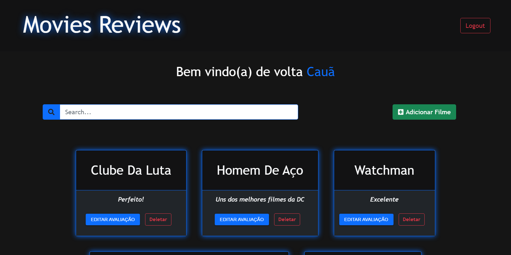

# Movies Reviews

Aplicação Web que adiciona avalições de filmes. A aplicação contém login/logout (com autenticação, por JWT), criação de conta, componente de pesquisa e CRUD para as avaliações.

   


<p align="center">
 <a href="#tecnologias">Tecnologias e Ferramentas Utilizadas</a> • 
 <a href="#requisitos">Requisitos</a> •
 <a href="#rodando">Rodando a Aplicação</a> •  
 <a href="#contribuicao">Contribuição</a>
</p>


<h3 align="center">  ✔  Movies Reviews 🚀 Concluído  ✔ </h4>



<div id=tecnologias></div>


### 🛠 Tecnologias e Ferramentas utilizadas

- [ReactJs](https://pt-br.reactjs.org/)
- [Node.Js](https://nodejs.org/en/)
- [MySQL](https://www.mysql.com/)
- [XAMPP](https://www.apachefriends.org/pt_br/index.html)
- [Express](https://expressjs.com/pt-br/)
- [Axios](https://axios-http.com/docs/intro)
- [Bootstrap](https://getbootstrap.com/)
- [Material-UI](https://mui.com/pt/)
- [Font Awesome](https://fontawesome.com/)
- [JWT](https://jwt.io/)

<div id="requisitos"></div>

## :heavy_exclamation_mark: Pré-requisitos

Para rodar a aplicação em sua máquina, você precisa ter instalado o [Node.Js](https://nodejs.org/en/), [MySQL](https://www.mysql.com/) ou o [XAMPP](https://www.apachefriends.org/pt_br/index.html) e um editor de código de sua preferência. O arquivo para colocar as informações necessárias para a conexão com o seu banco de dados é `server/index.js`, linha 40 à 45.

<div id="rodando"></div>

## &#127922; Rodando a aplicação

```bash
# Clone este repositório
$ git clone https://github.com/DOGE-SENAI/reviews-app.git

# Acesse a pasta do projeto no terminal/cmd
$ cd reviews-app

### Server ###
# Vá para a pasta server
$ cd server

# Instale as dependências
$ npm install

# Inicie o seu banco de dados e coloque as informações de seu banco de dados server/index.js nas linhas 40 à 45.
# Execute o server da aplicação
$ npm run devstart

### Client ###
# Vá para a pasta client
$ cd client

# Instale as dependências
$ npm install

# Execute a aplicação
$ npm start

# O servidor inciará na porta 3001 - acesse http://localhost:3001
# E o client iniciará na porta 3000.
```

<div id="contribuicao"></div>

### 👥 Contribuição

 👤 [Cauã Rodrigues](https://github.com/CauaRodrigues)

 👤 [Gabriel Mariano](https://github.com/Gabriel-MarianoJ)

 👤 [Gabriel dos Santos](https://github.com/GabrielGSF)

 👤 [Joabe Oliveira](https://github.com/Joabe18)

 👤 [João Victor](https://github.com/odrelvic)

 👤 [João Fernando](https://github.com/Joaocaetano1105)
